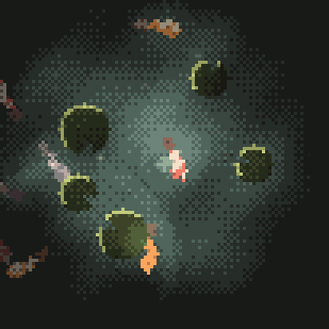
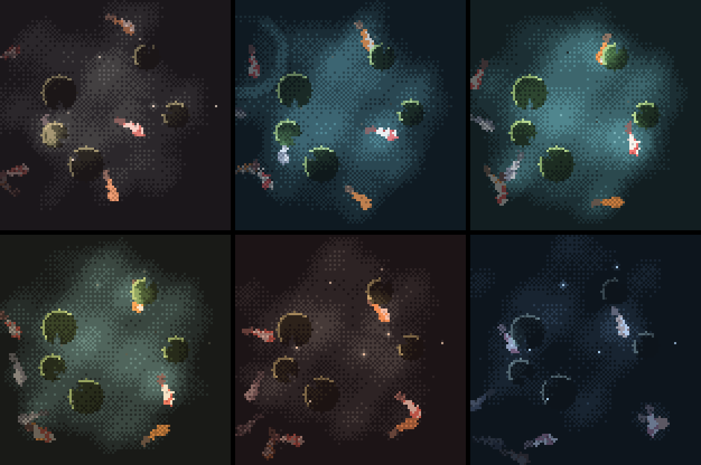
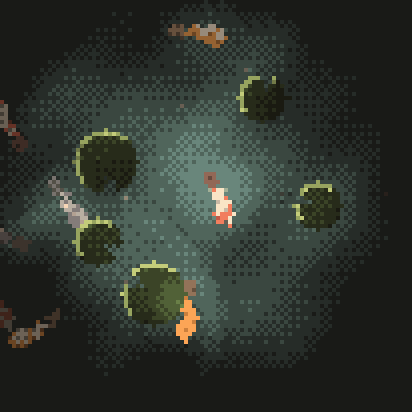

# Watcher Mochi

<p align="center">
  
</p>

A pixel koi pond for the [SenseCAP Watcher](https://www.seeedstudio.com/SenseCAP-Watcher-W1-A-p-5979.html). It runs its own day, dawn through night, with weather. Tap the glass and the koi swim over. Click the knob and it records the room to the SD card.

Nothing is loaded from storage. There are no image assets and no audio assets. Every frame is simulated and every sound is synthesised, so the firmware is the whole thing.

## What You Need

- SenseCap Watcher: [Buy here - 69$ - Coupon: 5EB420ZS](https://www.seeedstudio.com/SenseCAP-Watcher-W1-A-p-5979.html?sensecap_affiliate=3gToNR2&referring_service=link)
- A USB-C cable
- A computer with [ESP-IDF](https://docs.espressif.com/projects/esp-idf/en/stable/esp32s3/get-started/) v5.4+ installed

A microSD card is optional. Only recording needs one.

❤️ **If you want to buy a SenseCap Watcher, consider buying with the link or coupon above**. It's an affiliate link so I'll get a small percentage of your order as appreciation ^^

## Build and Flash

Install [ESP-IDF](https://docs.espressif.com/projects/esp-idf/en/stable/esp32s3/get-started/) v5.4 or newer, connect the Watcher over USB-C, then from this folder:

```sh
idf.py build
idf.py flash monitor
```

`flash` uploads the firmware, `monitor` shows the serial log. `Ctrl+]` exits the monitor.

## Controls

| | |
| --- | --- |
| **Tap the screen** | A ripple lands where your finger did, with a wet plop. Three rings spread out and every koi swims over to see what fell in. |
| **Hold the screen** | Fast forward. The day runs at speed under your finger, an hour every couple of seconds, stepping the weather along with it. Let go and it carries on from wherever it got to. |
| **Turn the knob** | Zoom, six steps. Wide open you get the whole pond. Closer in, the camera picks a koi and drifts after it. |
| **Click the button** | The pond turns red and starts recording. Click again to save the WAV to the card. |
| **Press the button** | Wakes it from sleep. |
| **Long-press the button** | Deep sleep, closing any recording on the way out. |
| **Do nothing for 5 minutes** | Deep sleep on its own, unless it is recording. |

Left alone it keeps going. The koi wander, the lily pads drift, a fish noses the surface every so often, something falls in over by the far bank now and then, and the light moves on through the day.

## The Day and the Weather

<p align="center">
  
</p>

Six hours run in order: dawn, morning, noon, afternoon, dusk, night. A sky is rolled on each one, weighted towards clear. The pond opens on a random hour, so waking the Watcher is not always dawn. `MOCHI_SCENE_DWELL_SEC` sets how long a scene holds (default 180, giving a full day in about 18 minutes). The GIF above is a time lapse. The real crossfade takes six seconds.

If eighteen minutes is longer than you want to wait, hold a finger on the glass. The pond fast forwards: an hour every two and a half seconds, the water and the koi moving at speed to match, and the weather stepping on in order rather than rolling for itself, so a hold of half a minute gets you every hour against every sky. Let go and the day picks up where the fast forward left it, at its own pace again. Recording still holds the day still, finger or no finger.

<p align="center">
  
</p>

The same instant of the same pond at each hour: dawn, morning, noon on the top row, afternoon, dusk, night on the bottom. Only the light differs between the six.

An hour relights the pond, it does not repaint it. A koi is the same orange at midnight as at noon. What changes is the light landing on it, so an hour carries a light and never a colour for the fish:

| field | what it sets |
| --- | --- |
| `night` | what everything fades to in shadow |
| `glow` | colour of the brightest light step |
| `light`, `light_mix` | colour of the illumination, and how hard it stains what it lands on |
| `sat` | how much of the pigment survives; the sky pulls this down as it greys over |
| `ambient` | light on open water at the middle of the pond |
| `birds`, `insects`, `frogs` | chance per frame of each being heard |

That is ten numbers per hour instead of a colour table each, and it is also what actually happens outdoors.

<p align="center">
  
</p>

Weather is a set of percentages applied on top of an hour. That is what keeps rain at midnight dark and rain at noon bright without authoring both by hand:

| sky | weight | saturation | ambient | other |
| --- | --- | --- | --- | --- |
| clear | 110 | 100% | 100% | |
| overcast | 45 | 70% | 78% | greyer light, choppier water |
| rain | 28 | 56% | 62% | rings on the water, faster drift |
| mist | 22 | 72% | 90% | heavy haze, calm water, bright motes |

Rain clears through overcast rather than stopping dead or lasting all day. Haze lifts the shadows only half as far as it washes out the light, because fog greys what you can see before it fills in what you cannot.

Weather drives behaviour too, not just colour. Each sky carries a `swell` (surface movement), a `drift` (pad and mote speed), a `rain` rate, a `mote_gain` and a `wind` rate. Rain reuses the ripple code: a few short-lived rings per second at random points, one drop in five loud enough to hear. Motes are barely visible at noon and burn like fireflies at night, brightest of all in mist.

The soundscape crossfades with the light, because the rates sit in the look next to the colours. An hour carries a chance per frame for birds, insects and frogs. A sky scales all three (rain quietens them to 22%) and adds its own wind. So the birds of a dawn thin out as the morning comes up, and the crickets of a dusk have already started before the light has finished going. None of it is heard while recording, because the sound module drops everything for the length of a file.

An hour and a sky compose into a `look_t`, and that is what gets rendered. Every field in it is a byte, so a crossfade is one pass over the struct:

```c
static void look_lerp(look_t *out, const look_t *a, const look_t *b, int t)
{
    for (size_t i = 0; i < sizeof(look_t); i++)
        o[i] = mix(pa[i], pb[i], t);   /* colours, speeds and rainfall together */
}
```

A `_Static_assert` on `sizeof(look_t)` keeps that valid if a wider field is ever added. A change starts from whatever is on screen at that instant, so weather turning mid sunrise carries on from where the sunrise had reached instead of jumping. The 84 ramp entries are rebuilt only on frames where something is actually moving.

All 24 hour and sky combinations were rendered off device and measured. Ambient light runs from 32 (night, rain) to 172 (noon, clear), and koi to water contrast never drops below 1.5:1, the floor being noon in mist.

## Recording

<p align="center">
  
</p>

Click the knob button. The water drops to a warm dusk, the lily pads rust over and every koi turns red. That is the Watcher listening to the room. Click again and the pond settles back into whatever hour it was in, with a WAV file on the card.

Recording is one more look through the same crossfade, over 32 frames instead of 150, because a button press should be answered quickly. It is the only look that changes pigment rather than light. No hour and no weather turns a koi red, which is why it reads as a mode and not as a time of day. It also holds the clock: the pond's day stops while it is listening and picks up afterwards, so a recording never gets a sunrise halfway through.

Measured against all 24 natural scenes, recording stays unmistakable. Natural water is always cool, warmest at `r-b = -2` on a clear dusk, against `+26` for recording. Recording is also the only look that puts all three koi in red, where the most any natural scene manages is two.

**The pond goes silent while recording.** The mic and the speaker are millimetres apart, so a plop played during a recording is a plop in the recording. Queued voices are dropped and anything mid ring is faded out inside one 16 ms block.

Recordings land in `/POND` on the card, numbered `REC00001.WAV` upwards, at 16 kHz mono 16-bit (about 2 MB a minute). The card is mounted on the first click rather than at boot, so a Watcher with no card costs nothing and one pushed in later works. With no card a click does nothing: the pond only turns red once a file is genuinely open, so the colour on the glass is the recording's own state.

Notes on [`main/recorder.c`](main/recorder.c):

- **Two tasks with a ring between them.** The problem is latency, not throughput. 32 KB/s is nothing for a card, but a FAT write can stall for tens of milliseconds allocating a cluster, while the I2S input has only about 90 ms of DMA behind it. One task that read a chunk then wrote it would drop samples on a slow card. So a reader does nothing but pull from the mic, a writer empties whatever has piled up, and the ring between them is four seconds deep in PSRAM. The reader outranks the writer, because a late write is absorbed and a late read is a hole.
- **The vision chip has to let go of the SPI bus.** The card and the Himax share SPI2 with a chip select each. The BSP parks the card's CS high before it talks to the vision chip, but nothing does the reverse. On a build that never brings the Himax up, its CS floats while the chip sits powered: the card's own clock edges select it, it drives MISO against the card, and every read fails with `data CRC failed`. `board_init()` parks GPIO 21 high once.
- **The header is patched on the way out.** WAV wants its two sizes at the front of the file and neither is known until the end, so the header goes down as zeros and is rewritten on close. A hard power cut leaves it unpatched.
- **The file always gets closed.** A long press finishes the recording before cutting power, the inactivity timeout does not fire while recording, and a recording nobody stops saves itself at `MOCHI_REC_MAX_SEC`.

## Zoom

<p align="center">
  
</p>

The same instant at three of the six detents. The pond is a fixed world and the screen is a camera window into it, so zooming changes how many screen pixels one world pixel gets. You see less of the pond, and what you do see is chunkier. Past the widest step the camera latches onto a koi and follows it, aiming a little ahead so the easing lag cancels out. A koi that swims under a lily pad glows through the leaf rather than disappearing, visible on the left pad in the last shot.

## A Pond That Moves

<p align="center">
  
</p>

The same pond, roughly forty seconds apart each time. These were rendered with three koi and five lily pads (the firmware now starts with eight koi). That whole count is simulated in every frame, but the koi roam past the rim, the pads drift, and everything dims with distance from the middle, so the number you can actually count moves around. Sometimes five pads, sometimes four. Sometimes three fish, sometimes one and a faint shape at the edge.

Counts are a runtime number, not a compile-time one:

```c
void pond_set_population(int koi, int pads, int motes);
void pond_get_population(int *koi, int *pads, int *motes);
```

Left to itself a drifting leaf is a 2D random walk, and a random walk spends most of its time far from where it started. The first version of this had every lily pad stranded against the rim within two minutes. So pads are free in the middle two thirds of the pond and steered back harder the further out they get, and they nudge each other apart so they crowd without stacking.

## How It's Drawn

Everything lives in [`main/pond.c`](main/pond.c). The pond is a fixed **103x103 world** of world pixels, a quarter of the 412x412 panel at the widest zoom, which is where the chunky pixels come from. Each visible cell carries a **material** and a **light level**, and colour only happens at the end:

```
per frame, into two buffers the size of the visible window:

  water            ambient light: radial falloff, crossing swells
  + koi glow       halo, added to open water only
  + ripples        crest and trough, added to open water only
  + koi bodies     material + its own light
  + lily pads      material, dimming whatever was under it
  + underglow      a koi showing through a leaf
  + motes          material + halo
        |
        v
  blit             colour = ramp[material][ (light + dither) -> 0..5 ]
        |
        v
  canvas           each cell painted as an s_pix x s_pix block
```

Because everything that glows just *adds light*, the koi, the rings and the motes sit in one lighting model instead of being three special cases. It is also why the day and the weather are cheap: they only change the ramps, and the simulation never finds out. Light falls off towards the rim, which is what makes the pond read as a pool in the dark rather than a flat background, and a 4x4 [ordered dither](https://en.wikipedia.org/wiki/Ordered_dithering) breaks up the banding between the six levels.

Details worth knowing:

- A tap spawns three staggered rings. Each adds light where `(d^2 - r^2) / 2r`, a cheap stand-in for the distance to the ring, lands near zero, and takes a little away just behind it for the trough. No `sqrt` in the inner loop.
- Koi are a 15x9 sprite sampled in *body* space, so they rotate with their heading for free. The tail flick is capped at one pixel; at two it tears away from the body.
- Markings are generated per fish, not baked into the sprite. A koi pattern is a few large irregular plates, one per length band so they run the whole fish, and any marking left with no neighbour is rubbed out again.
- Lily pads are a circle with a wedge notch, drawn as a dark silhouette with a lit rim on the side facing the light.

All of it is fixed-point integer maths on a 256-entry sine table. A frame costs a few milliseconds at 25 fps and leaves the CPU mostly idle.

## How It Sounds

Every sound in [`main/sound.c`](main/sound.c) is synthesised from the physics of what makes the noise.

The plop of something hitting water is not the drop. Phillips, Agarwal and Jordan filmed it with high speed cameras and found the sound is driven by a small **air bubble trapped under the surface**: the impact makes a brief click, the crater takes a few milliseconds to form, then the entrapped bubble rings and drives the water surface like a piston ([Scientific Reports, 2018](https://www.nature.com/articles/s41598-018-27913-0)). Each voice here is that same three part event: a filtered noise click, a short gap, then a decaying sine.

Two results give the rest for free:

- **[Minnaert's 1933 result](https://en.wikipedia.org/wiki/Minnaert_resonance)**, that a bubble in water resonates at `f0 * r = 3.26 Hz*m`. Voices are specified by *bubble radius*, not frequency, and the pitch falls out of the physics. A fingertip sized pocket of air (3 to 4 mm) rings around 800 to 1000 Hz.
- **[Van den Doel's liquid sound model](https://dl.acm.org/doi/10.1145/1101530.1101554)** (ACM TAP, 2005), where the pitch rises as the bubble rings: `f(t) = f0 * (1 + xi * d * t)` against an `e^(-d*t)` decay, with `xi = 0.1` found experimentally. That rise is the part your ear reads as *water*, and it costs one add per sample.

Four of the nine voices are water: the tap plop, a softer lower one when a koi noses the surface, a quiet far off drop with a long tail, and a raindrop. A raindrop traps a much smaller pocket of air than a fingertip does, so by Minnaert it rings near 2.2 kHz where the tap plop rings near 1.1 kHz, and it dies much faster.

A bird, a cricket and a frog have nothing to do with bubbles, so they are written as a frequency and a warble rather than as a radius, and they say so by leaving the radius at zero. Underneath they are the same voice: a tone, an envelope, and a little noise where the sound starts.

| voice | what it is |
| --- | --- |
| bird | a chirp near 3 kHz, sweeping up about 2.4 kHz per second |
| cricket | 4.4 kHz chopped by a 30 Hz warble |
| frog | 170 to 250 Hz chopped at 19 Hz |
| wind | no tone at all, just filtered noise fading in over 600 ms |

Wind is the one voice that needed something new. Low passed on its own it comes out as a subsonic rumble, most of it below what a speaker this size can move at all, so a second and much slower pole is subtracted from it. What is left is a band peaking near 450 Hz, where a small cone can actually shift air.

They mix in one task through two damped feedback combs, just enough reverb to put the pond in a dark room, then a `tanh` soft limiter so several sounds at once bend rather than clip. Bubble radius, tone and decay are randomised per hit, so no two plops are the same.

Rendered and measured on a host build of `sound.c`: nothing clips, the tap plop peaks at 14108 and rings at 1104 Hz (Minnaert for a 3 mm bubble), the raindrop at 2247 Hz, the cricket at 4355 Hz warbling at 30.5 Hz, the frog at 173 Hz warbling at 19.7 Hz, and the wind with 1.3% of its energy below 100 Hz.

For the record, a real dripping tap traps a bubble ten times smaller and plinks near 9 kHz, above the Nyquist limit of this 16 kHz codec and well past what its little speaker could move. Bigger, lower bubbles are both the right sound for a pond and the only one this hardware can make.

The audio task only streams while something is sounding. A clear noon is close to silent and costs nothing, but a night full of crickets keeps it busy.

## Configuration

`idf.py menuconfig`, under the **Mochi** menu:

| Option | Default | |
| --- | --- | --- |
| `MOCHI_DEEP_SLEEP_TIMEOUT_SEC` | 300 | Idle seconds before deep sleep |
| `MOCHI_REC_MAX_SEC` | 600 | Longest recording before it saves itself |
| `MOCHI_SCENE_DWELL_SEC` | 180 | How long one hour and weather holds; 0 never moves on |
| `MOCHI_POND_KOI_COUNT` | 8 | Koi simulated (max 12) |
| `MOCHI_POND_LILY_COUNT` | 5 | Lily pads simulated (max 12) |
| `MOCHI_POND_MOTE_COUNT` | 7 | Drifting motes (max 16) |

The population values are starting points. `pond_set_population()` changes any of them at runtime. Defaults are in `sdkconfig.defaults`.

## License

The firmware source code is licensed under the [Apache License 2.0](LICENSE).
